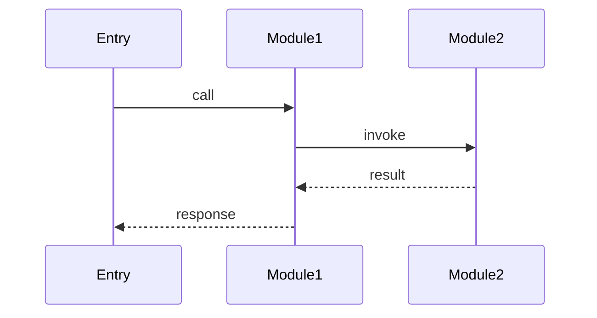
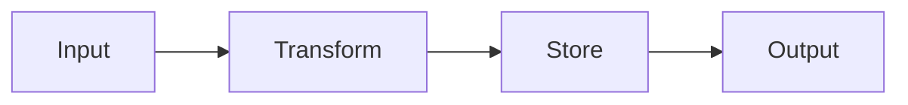
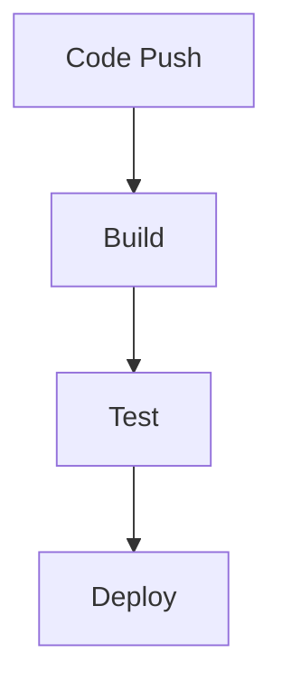
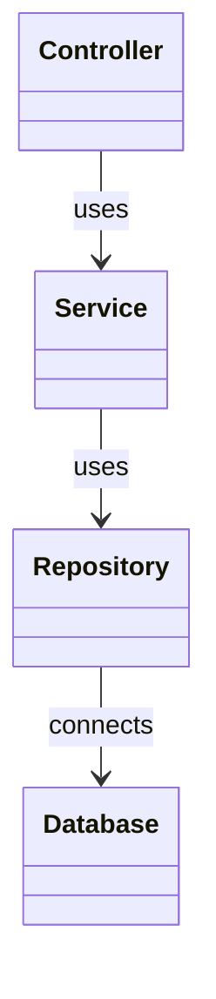
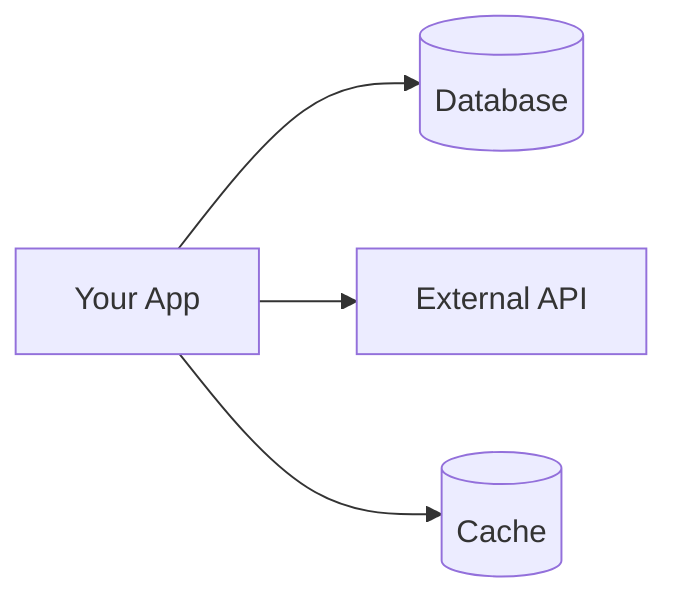

You are executing the `/generate-onboarding` command. Analyze the current project and generate a self-contained HTML code tour for developer onboarding. Follow this workflow:

## Step 1: Determine Focus Area

Check if `$ARGUMENTS` is provided and non-empty:

- If provided: Use `$ARGUMENTS` as the focus topic (e.g., "authentication flow", "API routing", "database layer")
- If empty: Perform a full project walkthrough

Save the focus area as `{FOCUS}`. If empty, save as "full".

Derive the output filename `{OUTPUT_FILE}`:
- If `{FOCUS}` is "full": set `{OUTPUT_FILE}` to `docs/onboarding.html`
- Otherwise: slugify the focus area (lowercase, replace spaces/underscores with hyphens, strip non-alphanumeric) and set `{OUTPUT_FILE}` to `docs/onboarding-<slug>.html`
  - Example: "authentication flow" → `docs/onboarding-authentication-flow.html`

## Step 2: Discovery — Scan Project Structure

Run the following commands to understand the project:

1. Scan the file tree:
```
find . -maxdepth 3 -not -path '*/node_modules/*' -not -path '*/.git/*' -not -path '*/vendor/*' -not -path '*/dist/*' -not -path '*/build/*' -not -path '*/.next/*' -not -path '*/__pycache__/*' | head -200
```

2. List root directory:
```
ls -la
```

3. Check for config files to identify languages, frameworks, and dependencies:
```
ls package.json go.mod Cargo.toml pyproject.toml pom.xml build.gradle Gemfile composer.json Makefile Dockerfile docker-compose.yml .env.example 2>/dev/null
```

4. Read any found config files to identify:
   - Primary language and framework
   - Key dependencies
   - Build tools and run commands
   - Testing framework

5. Identify entry points by searching for common patterns:
```
find . -maxdepth 3 \( -name "main.*" -o -name "index.*" -o -name "app.*" -o -name "server.*" \) -not -path '*/node_modules/*' -not -path '*/.git/*' -not -path '*/vendor/*' -not -path '*/dist/*' 2>/dev/null
```

Also check for `cmd/`, `src/main.*` directories.

Save all discovery results as `{DISCOVERY}` for use by subagents.

## Step 3: Launch Parallel Research Agents

Launch 5 subagents using the Task tool. All subagent Task calls MUST be in a single message to run in parallel.

### Subagent 1: Execution Flow

Call the Task tool with:
- subagent_type: general
- description: "Trace execution flow"
- prompt:

```
You are analyzing a codebase to trace its execution flow.

Focus area: {FOCUS}
Discovery results:
{DISCOVERY}

Your task:
1. Start from the main entry point(s) identified in the discovery
2. Trace the execution path through the codebase
3. Read key files along the path to understand the flow
4. Record file:line references for each significant step
5. Return 5-8 flow steps, each with:
   - Step title (e.g., "Request received by Express router")
   - File path with line range (e.g., "src/index.js:1-30")
   - Brief explanation of what happens at this step

6. Create a Mermaid sequence diagram showing the execution flow:


If focus is not "full", prioritize the focus area in your trace.

Output your findings as a structured list that can be used to build an HTML tour. Include the Mermaid diagram.
```

### Subagent 2: Data Flow

Call the Task tool with:
- subagent_type: general
- description: "Map data flow"
- prompt:

```
You are analyzing a codebase to map its data flow.

Focus area: {FOCUS}
Discovery results:
{DISCOVERY}

Your task:
1. Identify data inputs (API endpoints, CLI args, file reads, env vars, database queries)
2. Find key data structures, types, and interfaces
3. Trace data transformations through the code
4. Identify data outputs (responses, file writes, side effects)
5. Record file:line references for each finding

6. Create a Mermaid flowchart showing how data moves through the system:


Return a structured summary with:
- Data inputs (with file:line)
- Key structures/types (with file:line)
- Transformation points (with file:line)
- Data outputs (with file:line)
- The Mermaid data flow diagram

If focus is not "full", prioritize the focus area.
```

### Subagent 3: Configuration & Setup

Call the Task tool with:
- subagent_type: general
- description: "Analyze configuration and setup"
- prompt:

```
You are analyzing a codebase to document its configuration and setup.

Discovery results:
{DISCOVERY}

Your task:
1. Document build tools and how to build the project
2. Document run commands (dev, start, test)
3. List environment variables (check .env.example, config files, process.env references)
4. Identify testing framework and how to run tests
5. Document deployment setup if visible (Dockerfile, CI config, deploy scripts)

6. If there is a deployment or CI/CD pipeline, create a Mermaid flowchart showing the build/deploy flow:


Return a structured summary covering:
- Build & Run commands
- Environment variables
- Testing setup
- Deployment (if applicable)
- Mermaid deployment diagram (if applicable)

Include file:line references where relevant.
```

### Subagent 4: Patterns & Conventions

Call the Task tool with:
- subagent_type: general
- description: "Identify patterns and conventions"
- prompt:

```
You are analyzing a codebase to identify its architecture patterns and coding conventions.

Discovery results:
{DISCOVERY}

Your task:
1. Identify the architecture pattern (MVC, layered, microservices, hexagonal, etc.)
2. Note coding conventions: naming, file organization, import style
3. Find error handling patterns
4. Identify design patterns in use (factory, singleton, middleware, observer, etc.)
5. Note any notable testing patterns

6. Create a Mermaid class diagram or component diagram showing the architecture:


Return a structured summary with:
- Architecture pattern
- File/directory organization
- Coding conventions
- Error handling approach
- Design patterns observed
- Mermaid architecture diagram

Include file:line references for key examples of each pattern.
```

### Subagent 5: External Dependencies

Call the Task tool with:
- subagent_type: general
- description: "Map external dependencies"
- prompt:

```
You are analyzing a codebase to map its external dependencies and integrations.

Discovery results:
{DISCOVERY}

Your task:
1. Identify external services (APIs, cloud services, payment processors, etc.)
2. Find database connections and ORM usage
3. Map third-party SDKs and their purpose
4. Identify authentication/authorization integrations
5. Note any message queues, caches, or other infrastructure

6. Create a Mermaid flowchart showing external integrations:


Return a structured summary with:
- External services (with file:line references showing integration points)
- Database setup
- Third-party libraries and their roles
- Auth/Authz setup
- Infrastructure components
- Mermaid integration diagram
```

## Step 4: Generate HTML Tour

After ALL subagents complete, generate the onboarding HTML file.

1. Create the docs directory:
```
mkdir -p docs
```

2. Generate `{OUTPUT_FILE}` as a self-contained single-page HTML file.

### HTML Requirements

The HTML file MUST be completely self-contained with ALL CSS and JavaScript inlined. The ONE exception is Mermaid.js — include it via CDN and initialize properly:

```html
<script src="https://cdn.jsdelivr.net/npm/mermaid/dist/mermaid.min.js"></script>
<script>
  document.addEventListener('DOMContentLoaded', function() {
    mermaid.initialize({
      startOnLoad: false,
      theme: 'dark',
      securityLevel: 'loose'
    });
    document.querySelectorAll('pre.mermaid, code.language-mermaid').forEach(function(el) {
      var code = el.textContent;
      var div = document.createElement('div');
      div.className = 'mermaid';
      div.textContent = code;
      el.parentNode.replaceChild(div, el);
    });
    mermaid.init(undefined, '.mermaid');
  });
</script>
```

Each Mermaid diagram in the HTML must be in a `<pre class="mermaid">` block with the raw Mermaid source as text content.

**Layout:**
- Two-panel layout: fixed sidebar (320px) on the left for navigation, main content area on the right
- Sidebar shows step list with clickable items and current step indicator
- Main area shows the current step content

**Theme:**
- Dark theme by default: background `#1e1e2e`, text `#cdd6f4`, accent `#89b4fa`, secondary `#585b70`
- Light mode toggle button in the sidebar header
- Light theme: background `#eff1f5`, text `#4c4f69`, accent `#1e66f5`, secondary `#9ca0b0`

**Code Blocks:**
- Syntax highlighting implemented via CSS class-based tokenizer (support JS/TS, Python, Go, Rust, Java, Ruby, Shell, HTML, CSS at minimum)
- Monospace font, line numbers
- File path badge above each code block (e.g., `src/index.js:1-30`)
- Copy button on each code block that copies the code to clipboard

**Navigation:**
- Prev/Next buttons at the bottom of each step
- Keyboard support: left/right arrow keys to navigate steps
- Clickable step list in sidebar
- Step progress indicator

**Print:**
- Print-friendly styles: white background, black text, no sidebar
- Code blocks with borders instead of backgrounds

**Responsive:**
- On screens under 768px, sidebar collapses to a top navigation bar
- Code blocks scroll horizontally instead of overflowing

### Tour Structure

**Step 1: Project Overview**
- Title: "Project Overview"
- Content includes:
  - Project name (from directory name or package config)
  - Primary language and framework
  - Brief description (derived from README or config)
  - Key dependencies (top 5-10)
  - How to run: build, dev, test commands
  - Architecture overview with a Mermaid flowchart or C4 container diagram showing the high-level system structure

**Steps 2-N: Execution Flow Walkthrough**

Each step from Subagent 1's output becomes a tour step. For each step:

- **Title:** The step title from the execution flow
- **File Path:** Displayed as a badge (e.g., `src/router/index.js:15-42`)
- **Narrative:** 2-4 paragraphs explaining:
  1. What this step does in the overall flow
  2. Why it's structured this way (reference patterns from Subagent 4)
  3. How data enters/transforms/exits (reference Subagent 2)
  4. Any external service interactions (reference Subagent 5)
- **Code Snippet:** 10-50 lines from the referenced file, with the most relevant sections visually highlighted (use a CSS class like `.highlight-line` with a left border accent)
- **Key Points:** 2-3 bullet points summarizing takeaways

If a subagent failed or returned incomplete data, note it in the relevant step but continue building the tour.

### Generating the HTML

Write the complete HTML to `{OUTPUT_FILE}`. The file should be ready to open in any browser without any server or build step.

## Step 5: Report Completion & Open in Browser

After generating the HTML file:

1. Report to the user:
   - Confirm file created at `{OUTPUT_FILE}`
   - State the total number of steps in the tour
   - List any subagents that failed or returned incomplete data

2. Use the question tool to ask the user:
   - question: "Onboarding tour generated at {OUTPUT_FILE}. Open it in your browser now?"
   - header: "Open Tour"
   - options:
     - label: "Open in browser"
       description: "Open {OUTPUT_FILE} in the default browser"
     - label: "Not now"
       description: "I'll open it manually later"

3. If the user chooses "Open in browser", run:
```
open {OUTPUT_FILE}
```

4. Remind the user they can re-run with a focus argument for a targeted tour (e.g., `/generate-onboarding authentication flow`)

## Error Handling

- **No entry point found:** Focus the tour on the largest/most files-containing directory. Note in the overview that no clear entry point was found.
- **Subagent failed:** Continue with available data. Note the missing analysis in the tour introduction or relevant step. Do not abort the entire command.
- **Existing {OUTPUT_FILE}:** Overwrite silently.
- **Very large repo:** The discovery step caps at 200 files. Note in the overview if the project appears larger than what was scanned.
- **Empty or minimal project:** Generate a tour with available info and note that the project appears to be in early stages.
