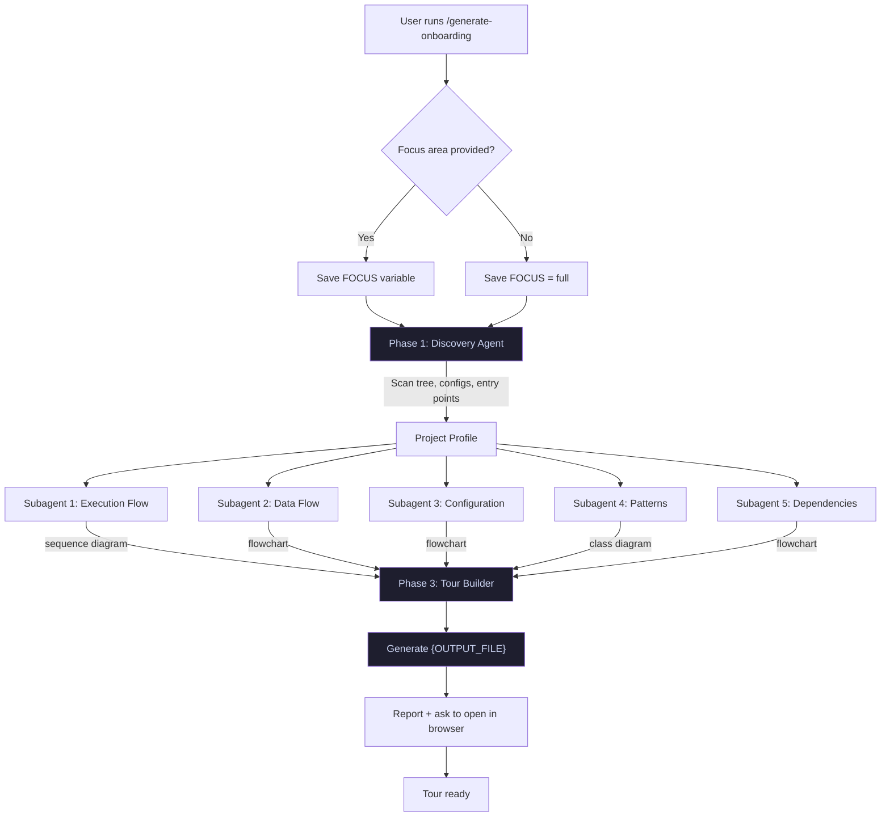
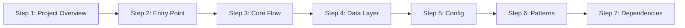

# Generate Onboarding Workflow

Architecture and flow for the `/generate-onboarding` command.

## Pipeline Overview

## Phase 1: Discovery

Single agent performs a quick scan:

| Action | Command |
|--------|---------|
| File tree | `find . -maxdepth 3 ... \| head -200` |
| Root listing | `ls -la` |
| Config files | `ls package.json go.mod Cargo.toml ...` |
| Entry points | `find . -name "main.*" -o -name "index.*" ...` |

Output: `{DISCOVERY}` — project profile passed to Phase 2.

## Output Filename

The output filename `{OUTPUT_FILE}` is derived from `{FOCUS}`:

| Focus | Output File |
|-------|-------------|
| `full` (no focus) | `docs/onboarding.html` |
| "authentication flow" | `docs/onboarding-authentication-flow.html` |
| "database layer" | `docs/onboarding-database-layer.html` |

Slugify rules: lowercase, replace spaces/underscores with hyphens, strip non-alphanumeric.

## Phase 2: Parallel Research Agents

Five subagents launched simultaneously via `Task` tool:

| Subagent | Focus | Diagram |
|----------|-------|---------|
| Execution Flow | Trace entry point through codebase | Sequence diagram |
| Data Flow | Inputs → transformations → outputs | Flowchart |
| Configuration | Build, run, env vars, testing, deploy | Flowchart (CI/CD) |
| Patterns | Architecture, conventions, design patterns | Class diagram |
| Dependencies | External services, APIs, databases | Flowchart |

Each returns structured findings with `file:line` references and a Mermaid diagram.

## Phase 3: Tour Builder

Takes all research outputs and generates `{OUTPUT_FILE}`:

- If no focus area: `docs/onboarding.html`
- If focus area provided (e.g., "authentication flow"): `docs/onboarding-authentication-flow.html`

Each step includes:
- File path badge
- 2-4 paragraph narrative
- Syntax-highlighted code snippet with highlighted lines
- Mermaid diagram (where applicable)
- Key points summary

## HTML Output

Self-contained single-page with:
- Two-panel layout (sidebar + code viewer)
- Dark theme with light mode toggle
- Mermaid.js via CDN for diagram rendering
- Step navigation (prev/next, keyboard, clickable list)
- Copy buttons on code blocks
- Print-friendly styles
