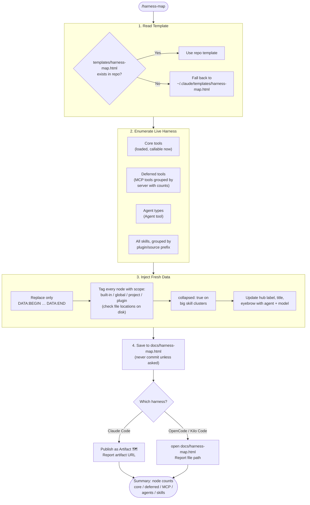
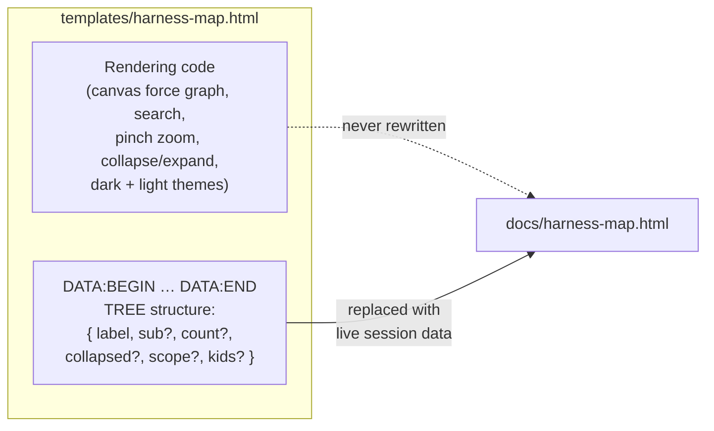
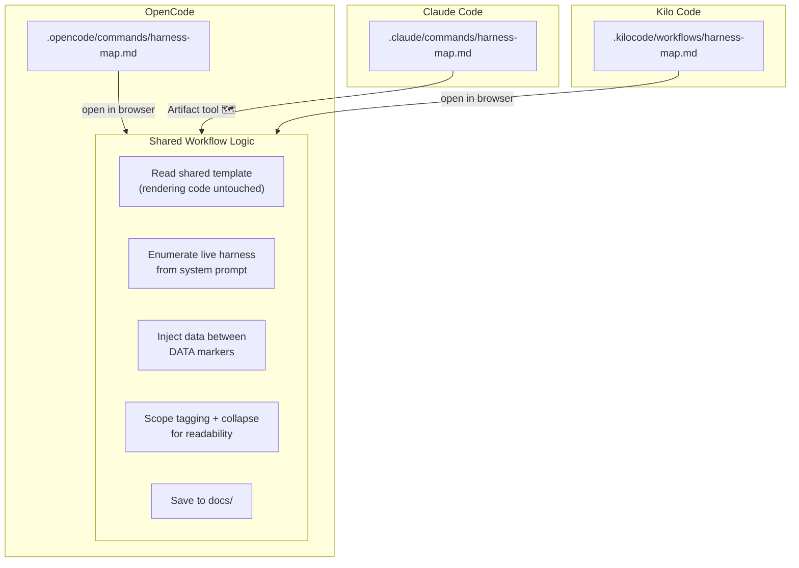

# Harness Map — Workflow Diagram

Covers: `/harness-map`

## Command Flow

```mermaid
flowchart TD
    Start(["/harness-map"]) --> Template

    subgraph Template["1. Read Template"]
        T1{"templates/harness-map.html\nexists in repo?"}
        T2["Use repo template"]
        T3["Fall back to\n~/.claude/templates/harness-map.html"]
        T1 -->|Yes| T2
        T1 -->|No| T3
    end

    Template --> Enumerate

    subgraph Enumerate["2. Enumerate Live Harness"]
        E1["Core tools\n(loaded, callable now)"]
        E2["Deferred tools\n(MCP tools grouped by\nserver with counts)"]
        E3["Agent types\n(Agent tool)"]
        E4["All skills, grouped by\nplugin/source prefix"]
    end

    Enumerate --> Inject

    subgraph Inject["3. Inject Fresh Data"]
        I1["Replace only\nDATA:BEGIN … DATA:END"]
        I2["Tag every node with scope:\nbuilt-in / global / project / plugin\n(check file locations on disk)"]
        I3["collapsed: true on\nbig skill clusters"]
        I4["Update hub label, title,\neyebrow with agent + model"]
        I1 --> I2 --> I3 --> I4
    end

    Inject --> Save["4. Save to docs/harness-map.html\n(never commit unless asked)"]

    Save --> Harness{"Which harness?"}
    Harness -->|"Claude Code"| Artifact["Publish as Artifact 🗺️\nReport artifact URL"]
    Harness -->|"OpenCode / Kilo Code"| Browser["open docs/harness-map.html\nReport file path"]

    Artifact --> Done(["Summary: node counts\ncore / deferred / MCP /\nagents / skills"])
    Browser --> Done
```

## Template Architecture

```mermaid
flowchart LR
    subgraph TemplateFile["templates/harness-map.html"]
        R["Rendering code\n(canvas force graph, search,\npinch zoom, collapse/expand,\ndark + light themes)"]
        D["DATA:BEGIN … DATA:END\nTREE structure:\n{ label, sub?, count?,\ncollapsed?, scope?, kids? }"]
    end

    R -.->|"never rewritten"| Out
    D -->|"replaced with\nlive session data"| Out["docs/harness-map.html"]
```

## Cross-Tool Compatibility

```mermaid
graph TD
    subgraph Core["Shared Workflow Logic"]
        CL1["Read shared template\n(rendering code untouched)"]
        CL2["Enumerate live harness\nfrom system prompt"]
        CL3["Inject data between\nDATA markers"]
        CL4["Scope tagging + collapse\nfor readability"]
        CL5["Save to docs/"]
    end

    subgraph OpenCode["OpenCode"]
        OC[".opencode/commands/harness-map.md"]
        OC -->|"open in browser"| Core
    end

    subgraph ClaudeCode["Claude Code"]
        CC[".claude/commands/harness-map.md"]
        CC -->|"Artifact tool 🗺️"| Core
    end

    subgraph KiloCode["Kilo Code"]
        KC[".kilocode/workflows/harness-map.md"]
        KC -->|"open in browser"| Core
    end
```
