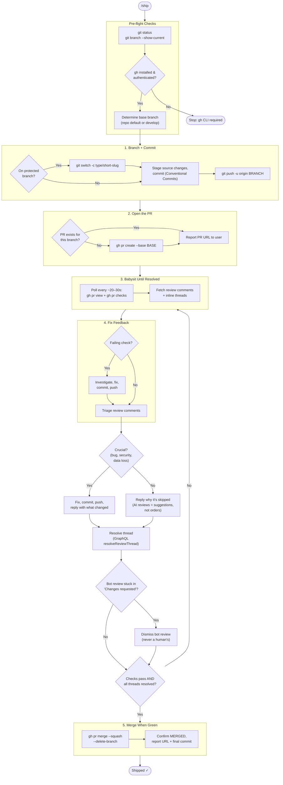
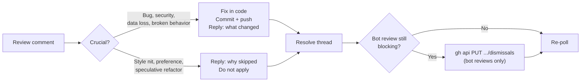
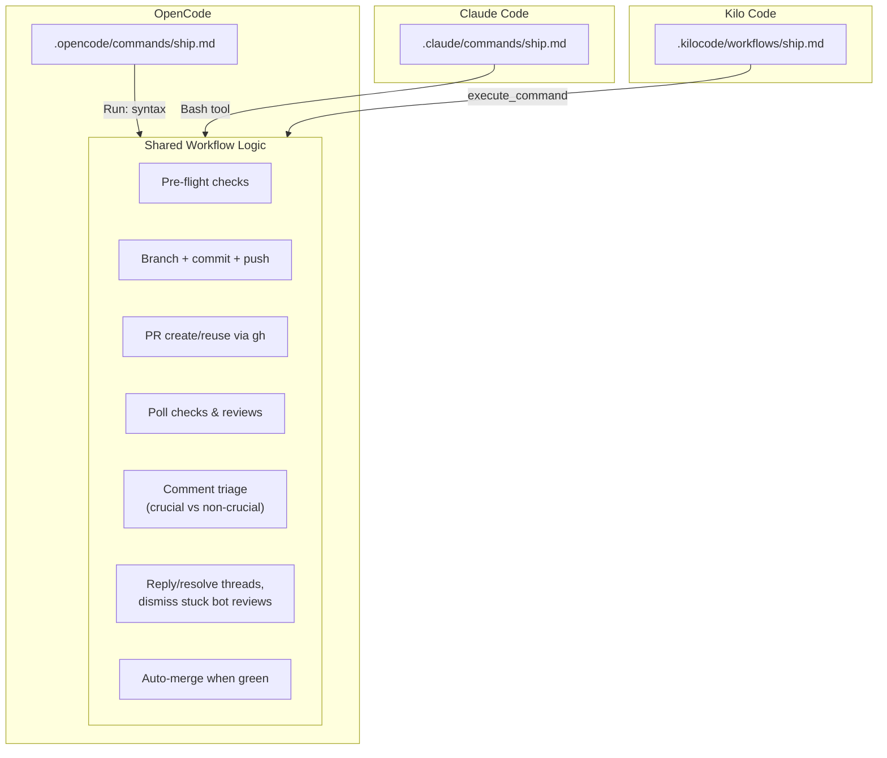

# Ship — Workflow Diagram

Covers: `/ship`

## Command Flow

```mermaid
flowchart TD
    Start(["/ship"]) --> PreFlight

    subgraph PreFlight["Pre-flight Checks"]
        PF1["git status\ngit branch --show-current"]
        PF2{"gh installed &\nauthenticated?"}
        PF3["Determine base branch\n(repo default or develop)"]
        PF1 --> PF2 -->|Yes| PF3
    end

    PF2 -->|No| Abort(["Stop: gh CLI required"])

    PF3 --> Branch

    subgraph Branch["1. Branch + Commit"]
        B1{"On protected\nbranch?"}
        B2["git switch -c type/short-slug"]
        B3["Stage source changes,\ncommit (Conventional Commits)"]
        B4["git push -u origin BRANCH"]
        B1 -->|Yes| B2 --> B3
        B1 -->|No| B3
        B3 --> B4
    end

    Branch --> PR

    subgraph PR["2. Open the PR"]
        PR1{"PR exists for\nthis branch?"}
        PR2["gh pr create --base BASE"]
        PR3["Report PR URL to user"]
        PR1 -->|Yes| PR3
        PR1 -->|No| PR2 --> PR3
    end

    PR --> Babysit

    subgraph Babysit["3. Babysit Until Resolved"]
        BS1["Poll every ~20–30s:\ngh pr view + gh pr checks"]
        BS2["Fetch review comments\n+ inline threads"]
        BS1 --> BS2
    end

    Babysit --> Fix

    subgraph Fix["4. Fix Feedback"]
        F1{"Failing check?"}
        F2["Investigate, fix,\ncommit, push"]
        F3["Triage review comments"]
        F1 -->|Yes| F2 --> F3
        F1 -->|No| F3
    end

    F3 --> Triage{"Crucial?\n(bug, security,\ndata loss)"}
    Triage -->|Yes| Apply["Fix, commit, push,\nreply with what changed"]
    Triage -->|No| Decline["Reply why it's skipped\n(AI reviews = suggestions,\nnot orders)"]
    Apply --> Resolve["Resolve thread\n(GraphQL resolveReviewThread)"]
    Decline --> Resolve
    Resolve --> BotStuck{"Bot review stuck in\n'Changes requested'?"}
    BotStuck -->|Yes| Dismiss["Dismiss bot review\n(never a human's)"]
    BotStuck -->|No| Green
    Dismiss --> Green

    Green{"Checks pass AND\nall threads resolved?"}
    Green -->|No| Babysit
    Green -->|Yes| Merge

    subgraph Merge["5. Merge When Green"]
        M1["gh pr merge --squash\n--delete-branch"]
        M2["Confirm MERGED,\nreport URL + final commit"]
        M1 --> M2
    end

    Merge --> Done(["Shipped ✓"])
```

## Review Comment Triage

```mermaid
flowchart LR
    C["Review comment"] --> T{"Crucial?"}
    T -->|"Bug, security,\ndata loss, broken behavior"| Fix["Fix in code\nCommit + push\nReply: what changed"]
    T -->|"Style nit, preference,\nspeculative refactor"| Skip["Reply: why skipped\nDo not apply"]
    Fix --> R["Resolve thread"]
    Skip --> R
    R --> B{"Bot review still\nblocking?"}
    B -->|Yes| D["gh api PUT .../dismissals\n(bot reviews only)"]
    B -->|No| Next["Re-poll"]
    D --> Next
```

## Cross-Tool Compatibility

```mermaid
graph TD
    subgraph Core["Shared Workflow Logic"]
        CL1["Pre-flight checks"]
        CL2["Branch + commit + push"]
        CL3["PR create/reuse via gh"]
        CL4["Poll checks & reviews"]
        CL5["Comment triage\n(crucial vs non-crucial)"]
        CL6["Reply/resolve threads,\ndismiss stuck bot reviews"]
        CL7["Auto-merge when green"]
    end

    subgraph OpenCode["OpenCode"]
        OC[".opencode/commands/ship.md"]
        OC -->|"Run: syntax"| Core
    end

    subgraph ClaudeCode["Claude Code"]
        CC[".claude/commands/ship.md"]
        CC -->|"Bash tool"| Core
    end

    subgraph KiloCode["Kilo Code"]
        KC[".kilocode/workflows/ship.md"]
        KC -->|"execute_command"| Core
    end
```
